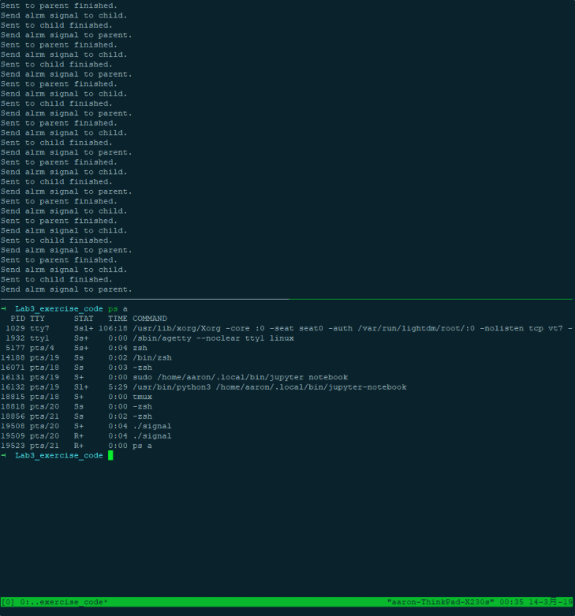
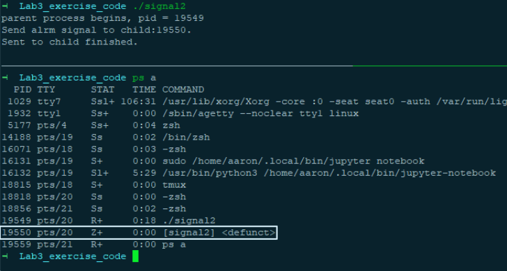

# Introduction

**Signals** in Linux, also called **software interrupts**, is a part of process control. Moreover, the signal method is one of the **IPC**(Inter-Process Communication) method, which is used to notify a process that an asynchronous event has occurred. **Note** that the function is only to notify what events have occurred but **does not pass any data.**

# Signals

1. **Name and Value**

	```Shell
        $ kill -l
         1) SIGHUP       2) SIGINT       3) SIGQUIT      4) SIGILL       5) SIGTRAP
         6) SIGABRT      7) SIGBUS       8) SIGFPE       9) SIGKILL     10) SIGUSR1
        11) SIGSEGV     12) SIGUSR2     13) SIGPIPE     14) SIGALRM     15) SIGTERM
        16) SIGSTKFLT   17) SIGCHLD     18) SIGCONT     19) SIGSTOP     20) SIGTSTP
        21) SIGTTIN     22) SIGTTOU     23) SIGURG      24) SIGXCPU     25) SIGXFSZ
        26) SIGVTALRM   27) SIGPROF     28) SIGWINCH    29) SIGIO       30) SIGPWR
        31) SIGSYS      34) SIGRTMIN    35) SIGRTMIN+1  36) SIGRTMIN+2  37) SIGRTMIN+3
        38) SIGRTMIN+4  39) SIGRTMIN+5  40) SIGRTMIN+6  41) SIGRTMIN+7  42) SIGRTMIN+8
        43) SIGRTMIN+9  44) SIGRTMIN+10 45) SIGRTMIN+11 46) SIGRTMIN+12 47) SIGRTMIN+13
        48) SIGRTMIN+14 49) SIGRTMIN+15 50) SIGRTMAX-14 51) SIGRTMAX-13 52) SIGRTMAX-12
        53) SIGRTMAX-11 54) SIGRTMAX-10 55) SIGRTMAX-9  56) SIGRTMAX-8  57) SIGRTMAX-7
        58) SIGRTMAX-6  59) SIGRTMAX-5  60) SIGRTMAX-4  61) SIGRTMAX-3  62) SIGRTMAX-2
        63) SIGRTMAX-1  64) SIGRTMAX
	```

2. **Processing Method**

    Mainly three types of methods.

    - **Ignore**, most signals can be handled in this way, but there are two types of signals that cannot be ignored ( `SIGKILL` and `SIGSTOP` , respectively ). Because they provide the kernel and superuser with a reliable way to terminate and stop the process, if ignored, the process becomes a process that no one can manage, which is apparently a scenario that the kernel designer does not want to see.
    - **Capture**, you need to tell the kernel, what the user wants to do with a signal, to put it bluntly, write a signal processing function, and then tell the kernel about the function. When the signal is generated, the kernel calls the user-defined function as a way to achieve the processing of a signal.
    - **Default**, for each signal, the system corresponds to the default processing action, when the signal occurs, the system will be automatically executed. However, for the system, most of the processing is more crude, that is, directly kill the process. The specific signal default action can use `man 7 signal` to view the specific definition of the system.

## Signal Register

1. Ordinary: `signal`

	```C
        #include <signal.h>
        typedef void (*sighandler_t)(int);
        sighandler_t signal(int signum, sighandler_t handler);
        ```

2. Advanced: `sigaction`

## Signal Send

1. Ordinary: `kill`

	```C
        #include <sys/types.h>
        #include <signal.h>
        int kill(pid_t pid, int sig);
        ```

2. Advanced: `sigqueue`

# Practice and exploration

An echo program using pipe and signal

    ```C
    #include <stdio.h>
    #include <unistd.h>
    #include <sys/types.h>
    #include <string.h>
    #include <signal.h>
    #include <stdlib.h>

    int pid;
    int pipe_fd[2];
    char buff[1024], input[1024];

    void write_data(){
    	sleep(1);
    	printf("\nMy pid is %d\n", getpid());
        printf("Please input a string:\n");
    	scanf("%s", input);
        write(pipe_fd[1], input, strlen(input));
        printf("Write finished\n");
    	kill(getppid(), SIGALRM);
    }

    void finish_write(){
    	close(pipe_fd[1]);
        printf("%d finish write\n", getpid());
    	exit(0);
    }

    void read_data(){
    	sleep(1);
        printf("\nMy pid is %d\n", getpid());
    	printf("read begins\n");
    	memset(buff, 0, sizeof(buff));
    	read(pipe_fd[0], buff, 1024);
    	printf("Read finished\n");
    	printf("Message is: %s\n", buff);
    	kill(pid, SIGALRM);
    }

    void finish_read(){
    	close(pipe_fd[0]);
    	printf("%d finish read\n", getpid());
        exit(0);
    }

    int main(){

    	if (pipe(pipe_fd) < 0){
    		printf("pipe create failed\n");
    	}

    	if ((pid = fork()) < 0){
    		printf("fork failed\n");
    	}

    	if (!pid){
    		printf("child process begins, pid = %d\n", getpid());
    		signal(SIGALRM, write_data);
    		signal(SIGINT, finish_write);
    		kill(getpid(), SIGALRM);
    		while (1){
    			// busy waiting
    		}
    	}
    	else{
    		printf("parent process begins, pid = %d\n", getpid());
    		signal(SIGALRM, read_data);
    		signal(SIGINT, finish_read);
    		while (1){
    			// busy waiting
    		}
    	}
    }
    ```

Upper program is a very simple example of signal registration and signal sending, which register the `SIGALRM` signal to certain function of parent process and child process.

    ```Shell
    $ gcc pipe.c -o pipe
    $ ./pipe
    parent process begins, pid = 19424
    child process begins, pid = 19425

    My pid is 19425
    Please input a string:
    hello
    Write finished

    My pid is 19424
    read begins
    Read finished
    Message is: hello

    My pid is 19425
    Please input a string:
    ^C19424 finish read
    19425 finish write
    ```

Here comes a question: What would happen if the signal registration `signal` execute after `kill` ?

Just change code below:

    ```C
    void write_data(){
    	// sleep(1)
    	printf("Send alrm signal to parent.\n");
    	kill(getppid(), SIGALRM);
      printf("Sent to parent finished.\n");
    }

    void read_data(){
    	// sleep(1)
      printf("Send alrm signal to child:%d.\n", pid);
    	kill(pid, SIGALRM);
      printf("Sent to child finished.\n");
    }

    if (!pid){
    		printf("child process begins, pid = %d\n", getpid());
    		signal(SIGALRM, write_data);
    		signal(SIGINT, finish_write);
        // kill(getpid(), SIGALRM);
    		while (1){
    		}
    	}
    	else{
    		printf("parent process begins, pid = %d\n", getpid());
    		signal(SIGALRM, read_data);
    		signal(SIGINT, finish_read);
        kill(getpid(), SIGALRM);
    		while (1){
    		}
    	}
	```

Note that, in my testing environment, the parent process always execute first.

If the sending signal process start from child process, it means that the parent process would already register the two signals (`SIGALRM` , `SIGINT` ).



In the contract, if the sending signal start from parent process, the parent process may run too fast to invoke `kill` to send the `SIGALRM` signal to its child process right before the signal registration of its child. If the `SIGALRM` signal is not registered, the default action is to terminate the current process after the process receives the `SIGALRM` signal.



# Reference

---

1. [https://www.jianshu.com/p/f445bfeea40a](https://www.jianshu.com/p/f445bfeea40a)

2. [http://www.cnblogs.com/taobataoma/archive/2007/08/30/875743.html](http://www.cnblogs.com/taobataoma/archive/2007/08/30/875743.html)
